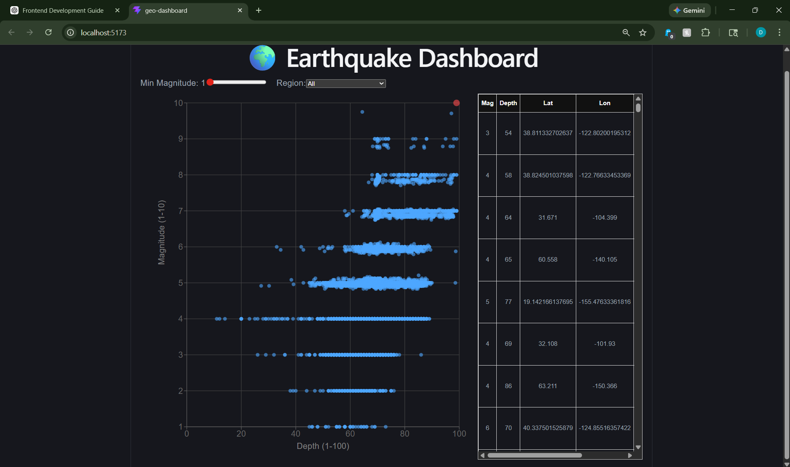
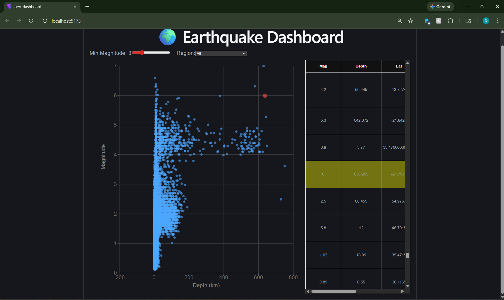

# 🌍 Earthquake Dataset Dashboard

## 📌 Overview

This project is an interactive **Earthquake Data Visualization Dashboard** built using React and TypeScript.

It allows users to:

* Explore earthquake data visually
* Filter results dynamically
* Interact between chart and table

---

## 🏗️ Project Structure

```
geo-dashboard/
│
├── public/
│   └── earthquakes_refined.csv
│
├── src/
│   ├── components/
│   ├── store.ts
│   ├── App.tsx
│
├── data-processing/
│   ├── earthquake_data_cleaning.py
│   ├── all_month.csv
│
├── package.json
├── README.md
```

---

## ⚙️ Tech Stack

* React – UI framework
* TypeScript – Type safety
* Recharts – Data visualization
* Zustand – State management
* PapaParse – CSV parsing

---

## 📊 Data Pipeline

### Step 1: Raw Data

Original dataset (`all_month.csv`) from USGS (~10,000 rows)

---

### Step 2: Data Cleaning (Python)

Script:

```bash
data-processing/earthquake_data_cleaning.py
```

Transforms:

* Removes unnecessary columns
* Handles missing values
* Extracts region
* Creates:

  * `magInt` (1–10)
  * `depthInt` (1–100, log scaled)

---

### Step 3: Final Dataset

Output:

```bash
public/earthquakes_refined.csv
```

Used directly in frontend.

---

## ⚠️ Key Design Decision

### Why NOT use standardized values (`magInt`, `depthInt`) for plotting?

Standardized values caused:

* Data clustering
* Overlapping points
* Straight-line artifacts

### Solution:

We used original values:

* `mag`
* `depth`

This ensures:

* Accurate distribution
* Better visualization
* Real-world representation

👉 Standardized values are still used for filtering.

---

## 📊 Visualization Comparison

### ❌ Using Standardized Values (magInt, depthInt)

<p align="center">
  
</p>

**Issues:**
- Data points collapse into fixed levels  
- Overlapping and straight-line patterns  
- Poor real-world representation  

---

### ✅ Using Original Values (mag, depth)

<p align="center">
  
</p>

**Benefits:**
- Natural spread of data  
- Accurate visualization  
- Better readability  

---

## 🎛️ Features

### 📈 Scatter Plot

* X-axis: Depth (km)
* Y-axis: Magnitude
* Responsive layout
* Highlighting on selection

---

### 📋 Data Table

* Scrollable
* Sticky header
* Row highlighting

---

### 🔁 Interaction

* Click chart → scroll table
* Click table → highlight chart

---

### 🎚️ Filters

* Magnitude slider
* Region dropdown

---

## ▶️ Setup Instructions

### 1. Clone repository

```bash
git clone https://github.com/YOUR_USERNAME/Earthquake-Dataset-Dashboard.git
cd geo-dashboard
```

---

### 2. Install dependencies

```bash
npm install
```

---

### 3. Run the app

```bash
npm run dev
```

---

### 4. Open in browser

```
http://localhost:5173
```

---

## 🧪 Optional: Run Data Cleaning Script

```bash
cd data-processing
python earthquake_data_cleaning.py
```